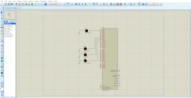

# DMA driver

## Project description: 
* You are required to develop a complete software driver for the DMA peripheral in the STM32F401 MCU.

## Project requirements:
Your driver should provide the following APIs

* A function to initialize the DMA driver.
* A function to initialize the DMA channel parameters, DMA Peripheral ID, Trigger source, Source address, destination address, number of transfers, transfer item size, transfer mode, transfer type(Single or burst).
* A function to request from the driver to start software transfer (memory to memory).
* A function to check the transfer state.

You have to configure the DMA interrupt and in the DMA ISR you have to call an notification function for the DMA client.  

Your test code should be a dummy client that create two arrays of integers of size 100 elements. One of them is already initialized with numbers of 100,200, … till the end. This will be the source array. 

The second one is the destination array with the same type and size and will be initialized by all zeros. 

Your DMA driver shall be used to copy the source array into the destination array. 

<!--  -->

